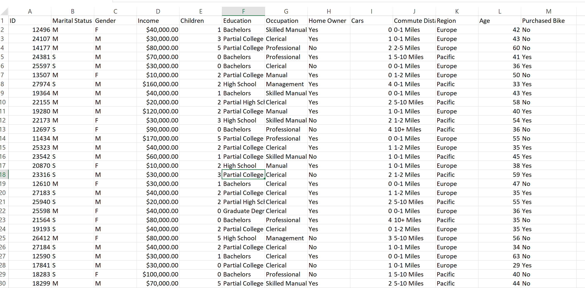
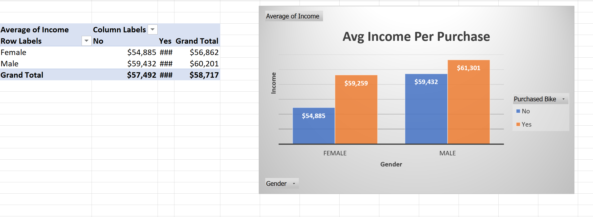

# Bike-Buyers-Excel-Pivot-Table-Analysis

# 🚴‍♂️ Bike Buyers – Excel Pivot Table Analysis

This project analyzes demographic and behavioral factors influencing bike purchases using Excel. It demonstrates advanced use of pivot tables, calculated fields, and visual dashboards to uncover trends across income, age, commute distance, and region.

---

## 🔧 Tools Used
- Microsoft Excel  
- Pivot Tables & Charts  
- Conditional Logic & Calculated Columns  
- Dashboard Design

---

## 📁 Dataset Overview
The dataset includes 538 customer records with attributes like:
- Gender, Income, Education, Occupation  
- Commute Distance, Region, Age  
- Bike Purchase Status

---

## 📊 Key Pivot Table Outputs

### 1. Raw Dataset Preview  
Shows cleaned and structured customer data used for analysis.  

### 2. Age Bracket Classification  
Used conditional logic to segment customers into Adolescent, Middle Age, and Old.  

### 3. Avg Income Per Purchase (by Gender)  
Pivot table and bar chart comparing average income between bike buyers and non-buyers.  

### 4. Commute Distance vs Purchase Behavior  
Line chart showing how commute length correlates with bike purchases.  

### 5. Age Bracket vs Purchase Behavior  
Pivot table and line chart showing bike purchases across age groups.  

### 6. Interactive Dashboard  
Combines filters and charts into a single view for dynamic exploration.  

---

## 🔍 Insights
- **Higher income** correlates with increased likelihood of purchasing a bike  
- **Middle-aged customers** are the most active buyers  
- **Shorter commute distances** show stronger purchase behavior  
- **Pacific region** has higher purchase rates than Europe

---

## 📦 Folder Structure
